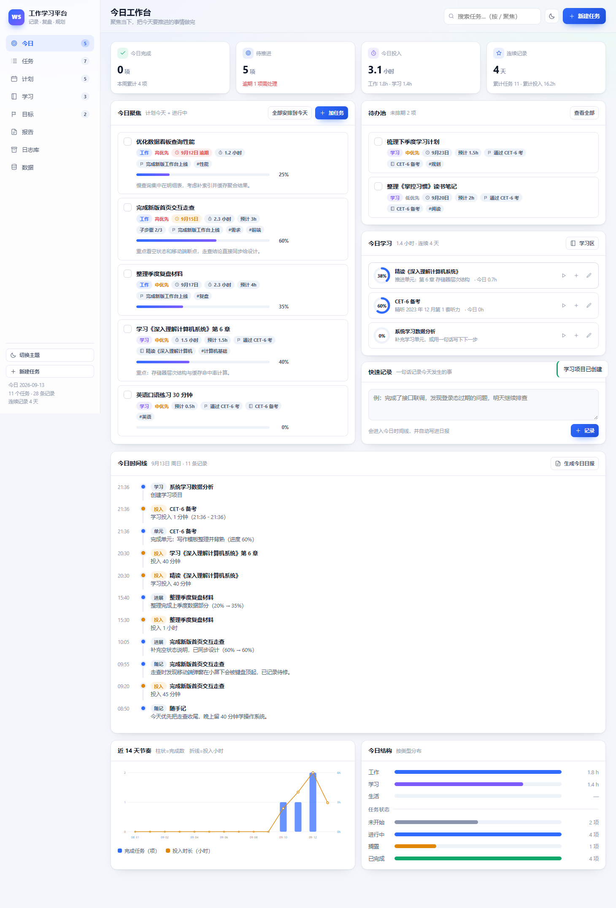
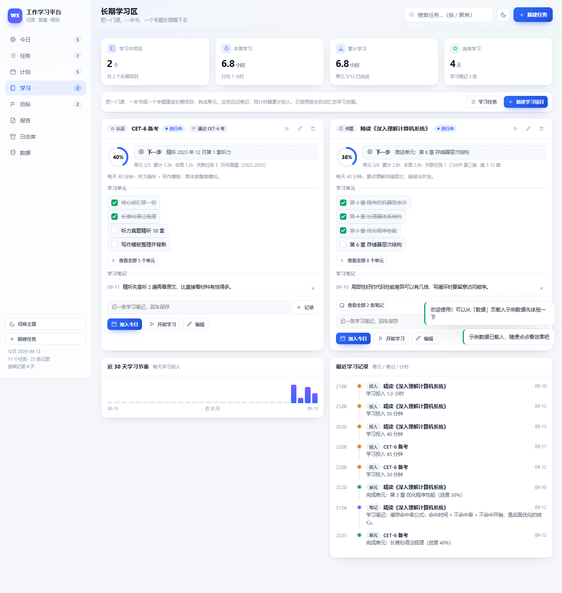

# 工作学习平台

> 一个单文件网页应用：记录任务进度、自动生成日报周报、规划工作与学习、管理长期学习项目。
> 不需要安装、不需要注册、不联网也能用，所有数据只保存在你自己的浏览器里。

**在线使用**：https://USERNAME_PLACEHOLDER.github.io/REPO_PLACEHOLDER/

## 界面预览

今日工作台：把今天要做的事、要学的东西、随手记的事放在一屏里。

长期学习区：一门课、一本书、一个专题跟几周几个月的进度。

## 功能

- **任务与进度**：任务可拆成子步骤，勾选子步骤自动换算进度；支持状态看板（拖拽换列）、一键计时、截止日期与优先级；每次改动都会自动留下一条进展记录，成为日报的素材。
- **自动日报 / 周报 / 月报**：根据当天的任务、进度更新、计时、随记和学习进展自动生成可编辑草稿；章节可自由开关（编号自动顺延），支持预览、复制、下载 Markdown、存入日志库。
- **计划与目标**：一周七天的排期表，把未排期的任务拖到某一天即可；长期目标可拆成里程碑，任务和学习项目都能关联到目标。
- **长期学习区**：课程 / 书籍 / 专题三类长期项目，学习单元勾选即更新进度环，支持批量粘贴章节目录、随手记学习笔记、学习计时、下一步提示，以及近 30 天学习节奏图。
- **日志库与数据**：历史日志归档检索、导出全部内容为 Markdown、导出 / 导入 JSON 备份、一键载入示例数据。

## 怎么用

1. 打开上面的网址即可（建议 Chrome 或 Edge，加到书签栏，随时随地能记一笔）。
2. 想离线用：下载 `index.html`，双击打开，效果完全一样。
3. 第一次用可以到「数据」页点**「载入示例数据」**看看效果，看完点「清空全部数据」重新开始。

## 关于数据（重要）

- 所有数据保存在**浏览器本地**，不会上传到任何服务器；这个仓库里也不包含任何个人数据。
- 数据**不跟随网址同步**：在线版和本地版、单位和家里，各自是一份独立数据。要在两边来回用，请在「数据」页用**「导出 JSON 备份」/「导入 JSON 备份」**搬一次（比如下班前导出，回家导入）。
- 清理浏览器数据或换电脑前，请先导出备份。

## 部署自己的副本

纯静态单文件应用，任何静态托管都能放。用 GitHub Pages 最省事：

1. 把这个仓库的 `index.html` 放在仓库根目录（默认已经是这样）。
2. 打开仓库的 **Settings → Pages**，Source 选 **Deploy from a branch**，分支选 **main**、目录选 **/ (root)**，然后 Save。
3. 等一分钟，访问 `https://<用户名>.github.io/<仓库名>/` 即可。

## 文件说明

| 文件 | 说明 |
| --- | --- |
| `index.html` | 应用本体，单文件、无依赖、无需构建 |
| `使用说明.md` | 详细使用说明（含快捷键和使用建议） |
| `previews/` | 界面截图 |

## 快捷键

| 按键 | 作用 |
| --- | --- |
| `N` | 新建任务 |
| `/` | 跳到搜索框，搜索任务 |
| `Enter` | 在「添加单元」「记一条学习笔记」输入框里快速提交 |
| `Esc` | 关闭弹窗 |
| `Ctrl` + `Enter` | 在任务 / 目标 / 学习项目弹窗里直接保存 |